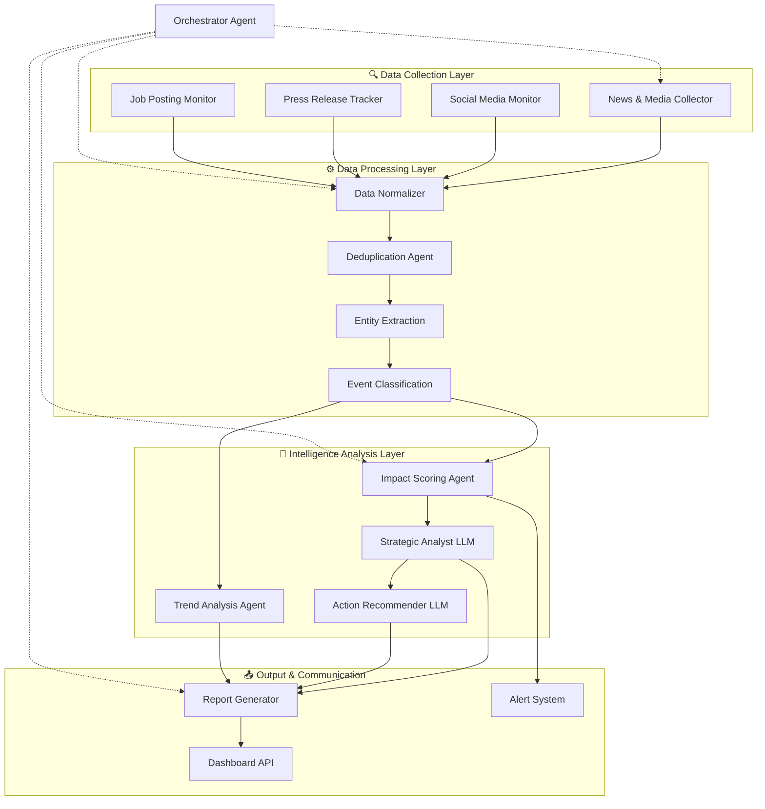
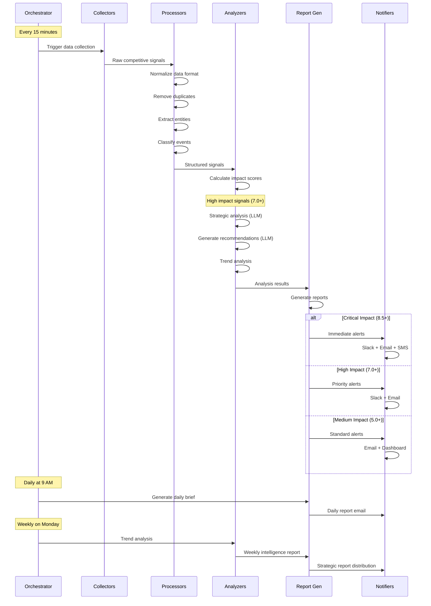

# 🕵️ Competitive Intelligence Multi-Agent System

[](https://python.org)
[](LICENSE)
[]()

> **Automated competitive intelligence monitoring and strategic analysis system that transforms competitor signals into actionable insights**

## 📖 Overview

The Competitive Intelligence Multi-Agent System is an advanced, AI-powered platform that continuously monitors competitor activities across multiple channels and transforms raw data into strategic insights. Instead of manually tracking dozens of sources, this system provides automated, structured intelligence that answers three critical questions:

- **What happened?** - Event detection and classification
- **Why does it matter?** - Strategic context and impact analysis  
- **What should we do?** - Actionable recommendations and strategic guidance

## 🚀 Key Features

- **🔄 Real-time Monitoring**: Continuous tracking across news, social media, press releases, and more
- **🧠 AI-Powered Analysis**: LLM-driven strategic analysis and recommendations
- **📊 Impact Scoring**: Quantitative assessment of competitive threat levels
- **⚡ Smart Filtering**: Automated deduplication and relevance scoring
- **📈 Trend Analysis**: Pattern recognition and market trend identification
- **🎯 Actionable Insights**: Strategic recommendations with urgency levels
- **📱 Multi-Channel Alerts**: Slack, email, and dashboard notifications

## 🏗️ System Architecture



## 🤖 Multi-Agent Components

### 📰 **Data Collection Agents**

#### **News & Media Collector Agent**
- **Purpose**: Monitors news outlets, RSS feeds, and press releases
- **Sources**: Google News API, RSS feeds, financial news sites, press release services
- **Output**: Raw news articles and press releases about competitors
- **Frequency**: Every 15 minutes for breaking news, hourly for regular sources

#### **Social Media Monitor Agent** 
- **Purpose**: Tracks competitor activities on social platforms
- **Sources**: Twitter/X, LinkedIn, YouTube, Reddit
- **Output**: Posts, announcements, customer sentiment data
- **Frequency**: Every 10-30 minutes depending on platform velocity

#### **Job Posting Monitor Agent**
- **Purpose**: Tracks hiring patterns to identify expansion and strategic shifts
- **Sources**: LinkedIn Jobs, Indeed, company career pages
- **Output**: New job postings with role analysis
- **Frequency**: Daily monitoring

### ⚙️ **Data Processing Agents**

#### **Data Normalizer Agent**
- **Purpose**: Standardizes data formats from different sources
- **Functions**: 
  - Text cleaning and standardization
  - Date/time normalization
  - Source attribution
  - Language detection and translation
- **Output**: Unified data structure for downstream processing

#### **Deduplication Agent**
- **Purpose**: Eliminates duplicate content across sources
- **Techniques**:
  - Content hashing for exact duplicates
  - Similarity detection for near-duplicates  
  - Time-window filtering
  - Cross-source duplicate identification
- **Output**: Unique, non-duplicate signals only

#### **Entity Extraction Agent**
- **Purpose**: Identifies and extracts key entities from text
- **Entities Extracted**:
  - Company names and subsidiaries
  - Product names and features
  - Key personnel and executives
  - Financial figures and metrics
  - Dates and locations
- **Technology**: NER models + LLM validation
- **Output**: Structured entity data with confidence scores

#### **Event Classification Agent**
- **Purpose**: Categorizes competitive events by type and significance
- **Event Categories**:
  - **Product Launch**: New products, features, or services
  - **Pricing Changes**: Price adjustments, promotions, packaging changes
  - **Marketing Campaign**: Advertising campaigns, brand initiatives
  - **Leadership Changes**: Executive appointments, departures
  - **Funding/Investment**: Fundraising, acquisitions, partnerships
  - **Expansion**: Geographic or market expansion
- **Technology**: Classification models + rule-based logic
- **Output**: Classified events with confidence scores

### 🧠 **Intelligence Analysis Agents**

#### **Impact Scoring Agent**
- **Purpose**: Quantifies the potential impact of competitor activities (0-10 scale)
- **Scoring Factors**:
  - **Competitor Size** (40%): Revenue, market share, market position
  - **Market Impact Potential** (40%): Direct competition, market disruption potential
  - **Timing & Context** (20%): Market timing, recency, business cycle relevance
- **Output**: Impact score with detailed reasoning and urgency level
- **Features**:
  ```python
  ImpactScore:
    - final_score: 7.8/10
    - urgency: "high"  
    - reasoning: "Large competitor pricing change affects core market"
    - component_breakdown: {...}
  ```

#### **Strategic Analyst Agent (LLM-Powered)**
- **Purpose**: Provides strategic context and analysis - "Why does this matter?"
- **Analysis Framework**:
  - Strategic context assessment
  - Threat and opportunity identification
  - Competitive positioning analysis
  - Market implications evaluation
  - Connection to broader industry trends
- **Technology**: GPT-4 with specialized prompts
- **Output**: Strategic insights with confidence levels
- **Key Functions**:
  - Threat level assessment (Critical/High/Medium/Low)
  - Opportunity identification and evaluation
  - Competitive positioning analysis
  - Market trend connections

#### **Action Recommender Agent (LLM-Powered)**
- **Purpose**: Generates specific, actionable recommendations - "What should we do?"
- **Recommendation Types**:
  - **Immediate Actions**: Response within 24-48 hours
  - **Short-term Strategy**: Actions within 1-3 months
  - **Long-term Planning**: Strategic shifts over 6+ months
- **Output**: Prioritized action list with timelines and resource requirements
- **Features**:
  - Urgency-based prioritization
  - Resource requirement estimation
  - Risk/benefit analysis
  - Implementation guidance

#### **Trend Analysis Agent**
- **Purpose**: Identifies patterns and trends across competitive activities
- **Analysis Types**:
  - Competitor behavior patterns
  - Market movement trends
  - Technology adoption patterns
  - Pricing trend analysis
  - Investment and expansion patterns
- **Output**: Trend reports with predictions and implications
- **Frequency**: Weekly trend analysis, monthly deep-dive reports

### 📤 **Output & Communication Agents**

#### **Report Generator Agent**
- **Purpose**: Creates structured reports and summaries
- **Report Types**:
  - **Daily Briefs**: Key events and immediate actions
  - **Weekly Intelligence**: Comprehensive analysis and trends
  - **Monthly Strategic**: Deep strategic analysis and recommendations
  - **Ad-hoc Reports**: Custom analysis for specific events
- **Formats**: PDF, HTML, PowerPoint, JSON
- **Features**: Executive summaries, detailed analysis, visual charts

#### **Alert System Agent**
- **Purpose**: Delivers timely notifications across multiple channels
- **Alert Channels**:
  - **Slack/Teams**: Real-time team notifications
  - **Email**: Detailed reports and summaries
  - **SMS**: Critical alerts only
  - **Dashboard**: Real-time monitoring interface
- **Alert Levels**:
  - **Critical** (8.5+ impact): Immediate notification to all channels
  - **High** (7.0+ impact): Priority alerts to key stakeholders
  - **Medium** (5.0+ impact): Standard notifications
  - **Low** (<5.0 impact): Dashboard only

#### **Orchestrator Agent**
- **Purpose**: Coordinates and manages the entire multi-agent system
- **Functions**:
  - Task scheduling and coordination
  - Agent health monitoring
  - Error handling and recovery
  - Resource optimization
  - Configuration management
- **Features**:
  - Agent lifecycle management
  - Performance monitoring
  - Automatic scaling
  - Failure recovery

## 🔄 System Workflow



## 🛠️ Installation & Setup

### Prerequisites
- Python 3.8+
- OpenAI API key
- News API keys (Google News, NewsAPI)

### Quick Start

1. **Clone the repository**
   ```bash
   git clone https://github.com/your-org/competitive-intelligence-system.git
   cd competitive-intelligence-system
   ```

2. **Install dependencies**
   ```bash
   pip install -r requirements.txt
   ```

3. **Environment setup**
   ```bash
   cp .env.example .env
   # Edit .env with your API keys and database credentials
   ```

4. **Database setup**
   ```bash
   python scripts/setup_database.py
   ```

5. **Configure competitors**
   ```bash
   python scripts/setup_competitors.py
   ```

6. **Start the system**
   ```bash
   # Start all agents
   python main.py

   # Or start individual components
   python -m agents.orchestrator
   ```

### Docker Deployment

```bash
# Build and start all services
docker-compose up -d

# View logs
docker-compose logs -f

# Stop services
docker-compose down
```

## ⚙️ Configuration

### Competitor Configuration
```yaml
competitors:
  - name: "TechCorp"
    size: "large"
    market_share: 0.25
    direct_competitor: true
    monitoring_keywords: ["techcorp", "tech corp"]
    
  - name: "StartupAI" 
    size: "startup"
    market_share: 0.02
    direct_competitor: true
    monitoring_keywords: ["startupai", "startup ai"]
```

### Agent Configuration
```yaml
agents:
  impact_scoring:
    weights:
      competitor_size: 0.4
      market_impact: 0.4  
      timing: 0.2
    
  strategic_analyst:
    model: "gpt-4"
    temperature: 0.3
    max_tokens: 2000
    
  collectors:
    news:
      sources: ["google_news", "news_api", "rss_feeds"]
      frequency: "15min"
    social:
      platforms: ["twitter", "linkedin"]
      frequency: "30min"
```

## 📊 Usage Examples

### Scoring a Competitive Signal
```python
from agents.impact_scoring import ImpactScoringAgent

# Initialize agent
scorer = ImpactScoringAgent(competitor_profiles)

# Score a signal
signal = {
    'competitor': 'TechCorp',
    'event_type': 'pricing_change',
    'text': 'TechCorp announces 40% price reduction...',
    'timestamp': datetime.utcnow()
}

score = scorer.score_signal(signal)
print(f"Impact Score: {score.final_score}/10")
print(f"Urgency: {score.urgency}")
print(f"Reasoning: {score.reasoning}")
```

### Strategic Analysis
```python
from agents.strategic_analyst import StrategicAnalystAgent

# Initialize with competitive context
analyst = StrategicAnalystAgent(
    competitive_context=our_company_context
)

# Analyze signal strategically  
analysis = await analyst.analyze_signal(signal)
print(f"Strategic Context: {analysis.strategic_context}")
print(f"Threats: {analysis.threat_assessment}")
print(f"Opportunities: {analysis.opportunity_assessment}")
```

## 📈 Monitoring & Analytics

### System Health Dashboard
- Agent performance metrics
- Processing throughput
- Error rates and recovery
- Cost monitoring (LLM usage)

### Intelligence Dashboard  
- Real-time competitive signals
- Impact score trends
- Competitor activity heatmaps
- Strategic alert summaries

### Analytics & Reporting
- Weekly intelligence reports
- Monthly strategic assessments  
- Trend analysis dashboards
- Custom competitor deep-dives

## 🔒 Security & Privacy

- **API Security**: All external APIs secured with authentication
- **Data Encryption**: Sensitive data encrypted at rest and in transit
- **Access Control**: Role-based access to intelligence reports
- **Compliance**: GDPR and SOC2 compliance measures
- **Audit Logging**: Complete audit trail of all system activities

## 🤝 Contributing

We welcome contributions! Please see our [Contributing Guide](CONTRIBUTING.md) for details.

### Development Setup
```bash
# Install development dependencies
pip install -r requirements-dev.txt

# Run tests
pytest

# Code formatting
black .
isort .

# Linting
flake8 .
```

## 📄 License

This project is licensed under the MIT License.

## 🆘 Support

- **Issues**: [GitHub Issues](https://github.com/your-org/competitive-intelligence-system/issues)
- **Discussions**: [GitHub Discussions](https://github.com/your-org/competitive-intelligence-system/discussions)

## 🗺️ Roadmap

### Phase 1 (Current) - Core Intelligence
- [x] Multi-source data collection
- [x] Basic event classification
- [x] Impact scoring system
- [x] LLM-powered strategic analysis
- [ ] Advanced trend analysis
- [ ] Real-time alerting system

### Phase 2 - Advanced Analytics
- [ ] Machine learning pattern recognition
- [ ] Predictive competitor modeling
- [ ] Market simulation capabilities
- [ ] Advanced visualization dashboard
- [ ] Mobile app for executives

### Phase 3 - Enterprise Features
- [ ] Multi-tenant architecture
- [ ] Advanced security features
- [ ] API marketplace integration
- [ ] Custom analysis frameworks
- [ ] Enterprise SSO integration

---

## Contributors
✉ Ahmed Abdulghany
- **Email**: ahmedabdulghany7@gmail.com
- **LinkedIn**: [LinkedIn Profile](https://www.linkedin.com/in/ahmedabdulghany/)
- **GitHub**: [GitHub Profile](https://github.com/ahmedabdulghany7)

✉ Omar Waleed
- **Email**: 
- **LinkedIn**: [LinkedIn Profile](https://www.linkedin.com/in/)
- **GitHub**: [GitHub Profile](https://github.com/)

✉ Omar Waleed
- **Email**: 
- **LinkedIn**: [LinkedIn Profile](https://www.linkedin.com/in/)
- **GitHub**: [GitHub Profile](https://github.com/)

✉ Mohammed Hamdy
- **Email**: 
- **LinkedIn**: [LinkedIn Profile](https://www.linkedin.com/in/)
- **GitHub**: [GitHub Profile](https://github.com/)

---

**Built for strategic competitive advantage**

*Transform your competitive intelligence from reactive monitoring to proactive strategic advantage.*
